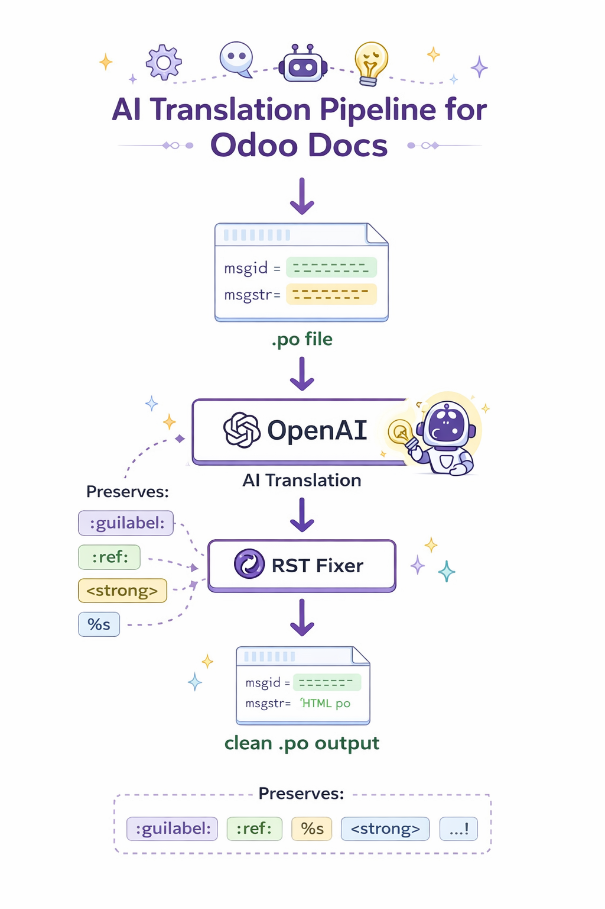

# Odoo Documentation AI Translation Tools



Tools for translating Odoo documentation `.po` files using AI and fixing RST (reStructuredText) formatting issues.

These scripts were created to help translators speed up the Odoo documentation translation workflow.

---

# Features

- Batch translation of `.po` files using AI
- Reduces API cost by translating multiple strings at once
- Preserves Sphinx / RST syntax
- Protects special roles such as:

```
:ref:
:doc:
:guilabel:
:menuselection:
```

- Fixes common formatting issues after translation

---

# Scripts

## translate_po_batch_v1.py

Batch translates `.po` entries using the OpenAI API.

Features:

- Batch translation
- API cost optimization
- Keeps untranslated entries safe

Example usage:

```bash
python translate_po_batch_v1.py input.po output.po
```

---

## fix_rst_po_ver3.py

Fixes RST / Sphinx formatting issues in translated `.po` files.

Example usage:

```bash
python fix_rst_po_ver3.py input.po output.po
```

---

# Workflow Example

Typical workflow when translating Odoo documentation:

```
original.po
   ↓
translate_po_batch_v1.py
   ↓
translated.po
   ↓
fix_rst_po_ver3.py
   ↓
clean_translated.po
```

---

# Requirements

Python 3.9+

Libraries:

```
polib
openai
```

Install with:

```bash
pip install polib openai
```

---

# Why this project exists

Translating Odoo documentation manually is time-consuming.

This project helps translators:

- automate repetitive translation tasks
- reduce API cost
- prevent syntax errors in Sphinx documentation

---

# License

MIT License (recommended)

---

# Author

GitHub  
https://github.com/tobio-nakai
